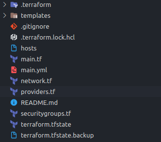

Hi everyone,

This is a tutorial I am going to walk through how to deploy [Appwrite](https://appwrite.io/) to [AWS EC2](https://aws.amazon.com/ec2/) instance using [Terraform](https://www.terraform.io/) and [Ansible](https://www.ansible.com/).

Appwrite is a self-hosted solution that provides developers with a set of easy-to-use and integrate REST APIs to manage their core backend needs.

We will use Terraform to provision the underlying infrastructure and manage configurations and deploy appwrite using Ansible.

code for this tutorial can be found in 



### prerequisites

- aws account [AWS free tier](https://aws.amazon.com/free/)
- Terraform installed [Terraform official tutorial](https://learn.hashicorp.com/tutorials/terraform/install-cli?in=terraform/aws-get-started) and
  setup with aws credentials [Terraform official tutorial](https://learn.hashicorp.com/tutorials/terraform/aws-build?in=terraform/aws-get-started)
- Ansible installed [Ansible official installation guide](https://docs.ansible.com/ansible/latest/installation_guide/intro_installation.html)
- AWS Key pair for SSH connection [AWS UserGuide](https://docs.aws.amazon.com/AWSEC2/latest/UserGuide/ec2-key-pairs.html)

## Provisioning infrastructure with Terraform

we'll start by provisioning the infrastructure needed to deploy appwrite using terraform.

in this tutorial, we will be provision

1. VPC and subnet to run EC2 instance
2. Internet gateway to expose subnet to internet
3. route table and route table association to associate route table with subnet
4. EC2 instance to deploy appwrite
5. security groups to allow inbound(`http` , `https`) and outbound web traffic to EC2 instance to expose appwrite

first, create a folder of your choice and then create `providers.tf` file . this file will hold information about the cloud provider. next, initialize terraform project using `terraform init` . this will allow terraform to download necessary binaries and initiate terraform.

### providers.tf

```tf
terraform {

  required_providers {
    aws = {
      source  = "hashicorp/aws"
      version = "~> 3.27"
    }
  }

  required_version = ">= 0.14.9"

}

provider "aws" {

  profile = "default"
  region  = "us-east-1"

}
```

after that, we need to create our first component, AWS [VPC](https://aws.amazon.com/vpc/) . `VPC` stands for Virtual Private Cloud, which is like a complete network infrastructure layer for your cloud applications. next, we need to create a subnet in our `VPC`. this is where our EC2 instance is placed in the network.

To expose this subnect to the internet we need to provision an [Internet Gateway](https://docs.aws.amazon.com/vpc/latest/userguide/VPC_Internet_Gateway.html) and also [route table](https://docs.aws.amazon.com/vpc/latest/userguide/VPC_Route_Tables.html) and [route table associations](https://docs.aws.amazon.com/vpc/latest/userguide/WorkWithRouteTables.html#AssociateSubnet) to associate the route table with this subnet.

### network.tf

```tf

# VPC
resource "aws_vpc" "vpcappwriteiacdemo" {
  cidr_block = "10.0.0.0/16"
  tags = {
    "Name" = "vpc_appwriteiacdemo"
  }
}

# Public subnet
resource "aws_subnet" "publicsubnetappwriteiacdemo" {
  vpc_id                  = aws_vpc.vpcappwriteiacdemo.id
  cidr_block              = "10.0.1.0/24"
  map_public_ip_on_launch = true

}


#IGW
resource "aws_internet_gateway" "igwappwriteiacdemo" {
  vpc_id = aws_vpc.vpcappwriteiacdemo.id
  tags = {
    "Name" = "igw_appwriteiacdemo"
  }
}

resource "aws_route_table" "crtpublicappwriteiacdemo" {
  vpc_id = aws_vpc.vpcappwriteiacdemo.id


  route {
    cidr_block = "0.0.0.0/0"
    # directs to IGW
    gateway_id = aws_internet_gateway.igwappwriteiacdemo.id
  }


  tags = {
    "Name" = "custom_public_route_table_appwriteiacdemo"
  }
}


resource "aws_route_table_association" "racappwriteiacdemo" {
  subnet_id      = aws_subnet.publicsubnetappwriteiacdemo.id
  route_table_id = aws_route_table.crtpublicappwriteiacdemo.id
}
```

after that, we need to specify the [security groups](https://docs.aws.amazon.com/AWSEC2/latest/UserGuide/ec2-security-groups.html) to allow web traffic to the EC2 instance we are provisioning. for that create `securitygroups.tf` file.

here we provision 4 security groups.

1. allow http ingress traffic (allow inbound http traffic to EC2) : port `80` 

2. allow https ingress traffic (allow inbound https traffic to EC2) : port `443`

3. allow ssh ingress traffic (allow inbound ssh traffic to EC2) : port `22`

4. allow all egress traffic (allow all outbound traffic to EC2)


### securitygroups.tf

```tf
resource "aws_security_group" "sg_allow_http_ingress_appwriteicademo" {
  name = "sg_allow_http_ingress_appwriteicademo"
  vpc_id = aws_vpc.vpcappwriteiacdemo.id
  ingress {
    description      = "http"
    from_port        = 80
    to_port          = 80
    protocol         = "tcp"
    cidr_blocks      = ["0.0.0.0/0"]
    ipv6_cidr_blocks = ["::/0"]
  }

}

resource "aws_security_group" "sg_allow_https_ingress_appwriteicademo" {
  name = "sg_allow_https_ingress_appwriteicademo"
  vpc_id = aws_vpc.vpcappwriteiacdemo.id
  ingress {
    description      = "http"
    from_port        = 443
    to_port          = 443
    protocol         = "tcp"
    cidr_blocks      = ["0.0.0.0/0"]
    ipv6_cidr_blocks = ["::/0"]
  }

}

resource "aws_security_group" "sg_allow_ssh_ingress_appwriteicademo" {
  name = "sg_allow_ssh_ingress_appwriteicademo"
  vpc_id = aws_vpc.vpcappwriteiacdemo.id
  ingress {
    description      = "http"
    from_port        = 22
    to_port          = 22
    protocol         = "tcp"
    cidr_blocks      = ["0.0.0.0/0"]
    ipv6_cidr_blocks = ["::/0"]
  }

}


resource "aws_security_group" "sg_allow_all_egress_appwriteicademo" {
  name = "sg_allow_all_egress_appwriteicademo"
  vpc_id = aws_vpc.vpcappwriteiacdemo.id

  egress {
    from_port        = 0
    to_port          = 0
    protocol         = "-1"
    cidr_blocks      = ["0.0.0.0/0"]
    ipv6_cidr_blocks = ["::/0"]
  }

}
```

now we are almost there, just need to create our `main.tf` file where we specify EC2 instance to provision.

in this tutorial, we will provision `t2 small` EC2 instance to the public subnet we created in our previous steps.
I choose `t2 small` instance type because the [minimum requirements](https://appwrite.io/docs/installation#systemRequirements) to run Appwrite is 1 CPU core and 2GB of RAM which matches with [t2 small](https://aws.amazon.com/ec2/instance-types/t2/) instance type.

[AMI](https://docs.aws.amazon.com/AWSEC2/latest/UserGuide/AMIs.html) we use here is `Ubuntu Server 20.04 LTS (HVM)`.security groups we created earlier also have specified to our EC2 instance along with the subnet.

**Make sure you added your key pair name in `key_name` value.**

### main.tf

```tf

resource "aws_instance" "appwrite-demo" {
  ami           = "ami-09e67e426f25ce0d7" # ubuntu 20 image
  instance_type = "t2.small"
  tags          = { Name : "appwrite-ec2" }
  key_name               = "your-key-pair-name"
  vpc_security_group_ids = [aws_security_group.sg_allow_all_egress_appwriteicademo.id,
  aws_security_group.sg_allow_http_ingress_appwriteicademo.id ,
  aws_security_group.sg_allow_https_ingress_appwriteicademo.id
  ]
  subnet_id              = aws_subnet.publicsubnetappwriteiacdemo.id
}


# log public-ip after privisioning
output "public-ip" {
  value = aws_instance.appwrite-demo.public_ip
}

```

now we have all the elements we need, let's apply this configuration using `terraform apply` command.

### terraform output


make sure you can connect to the EC2 instance using the key pair you specified before proceeding to the next steps.

### aws network diagram


<br>

## Manage configurations and deploy appwrite using Ansible

First, create an inventory file named `hosts` and add EC2 instance public ip

### hosts

```
your-ec2-public-ip-address
```

our newly provisioned EC2 instance has a fresh copy of ubuntu, so we need need to install [docker](https://www.docker.com/) and [docker-compose](https://docs.docker.com/compose/) to deploy appwrite.

We can start by creating `main.yml` file as the ansible playbook . in this file, we will have all the tasks we need to execute deploy appwrite.

First, we will update apt packages, and install dependency packages for docker and docker-compose . 

Next we will install docker and docker-compose. 

Finally, we will copy the `docker-compose.yml` and `.env` files (which we will download in the next step) to EC2 instance deploy appwrite using docker-compose.

### main.yml

```yml
- become: yes
  hosts: all
  name: deploy-appwrite
  user: ubuntu
  tasks:
    - name: Update all packages
      apt:
        upgrade: dist
        update_cache: yes
        cache_valid_time: 3600

    - name: Install a list of common dependancy packages
      apt:
        pkg:
          - apt-transport-https
          - ca-certificates
          - software-properties-common

    # install docker

    - name: docker gpg setup
      apt_key:
        url: https://download.docker.com/linux/ubuntu/gpg
        state: present

    - name: add docker apt repository
      apt_repository:
        repo: deb [arch=amd64] https://download.docker.com/linux/ubuntu focal stable
        update_cache: yes
        state: present

    - name: Update repositories cache
      apt:
        update_cache: yes

    - name: Install docker-ce
      apt:
        name: docker-ce

    - name: add ubuntu to docker
      user:
        name: ubuntu
        group: docker

    # install docker-compose
    - name: get platform
      shell: "uname -s"
      args:
        executable: /bin/bash
      register: platform

    - name: get architecture
      shell: "uname -m"
      args:
        executable: /bin/bash
      register: arch

    - name: install docker-compose
      get_url:
        url: https://github.com/docker/compose/releases/download/1.27.4/docker-compose-{{platform.stdout}}-{{arch.stdout}}
        dest: /usr/local/bin/docker-compose
        mode: "u+x,g+x"

    - name: Install Docker SDK for Python
      apt:
        pkg:
          - python3
          - python3-pip

    - name: Update repositories cache
      apt:
        update_cache: yes

    - name: Install Docker SDK for Python
      pip:
        name: "docker<5"
      become: yes

    - name: Install docker-compose SDK for Python
      pip:
        name: "docker-compose"
      become: yes

    # deploy appwrite
    - name: Create appwrite directory
      file:
        path: /home/ubuntu/appwrite/
        state: directory

    - name: Copy docker-compose.yml
      template:
        src: templates/docker-compose.yml.j2
        dest: /home/ubuntu/appwrite/docker-compose.yml

    - name: Copy .env
      template:
        src: templates/.env
        dest: /home/ubuntu/appwrite/.env

    - name: docker compose up
      docker_compose:
        project_src: /home/ubuntu/appwrite
      register: output
```

Now create `templates` directory and add `docker-compose.yml` and `.env` files to `templates` directory from this GitHub gist.

[GitHub gist](https://gist.github.com/eldadfux/977869ff6bdd7312adfd4e629ee15cc5)



[Appwrite docs](https://appwrite.io/docs/installation#manual)

### final folder structure



Now we have all the pieces in hand, let's run ansible playbook using the following command.

In this command, we pass `main.yml` as our playbook
`-i` flag to pass our inventory file `hosts` 

`--private-key` flag to pass the key pair, to ssh EC2 instance.

`ansible-playbook main.yml -i hosts --private-key [path-to-your-key] `

Let's run ansible playbook and watch the magic happens 🪄.


After successfully running ansible playbook now you can visit your EC2 public ip address and view the appwrite signup page.


Now we can use appwrite and start building applications.


<br>


## Thanks for reading till the end 🙌
## Cheers 🥂
